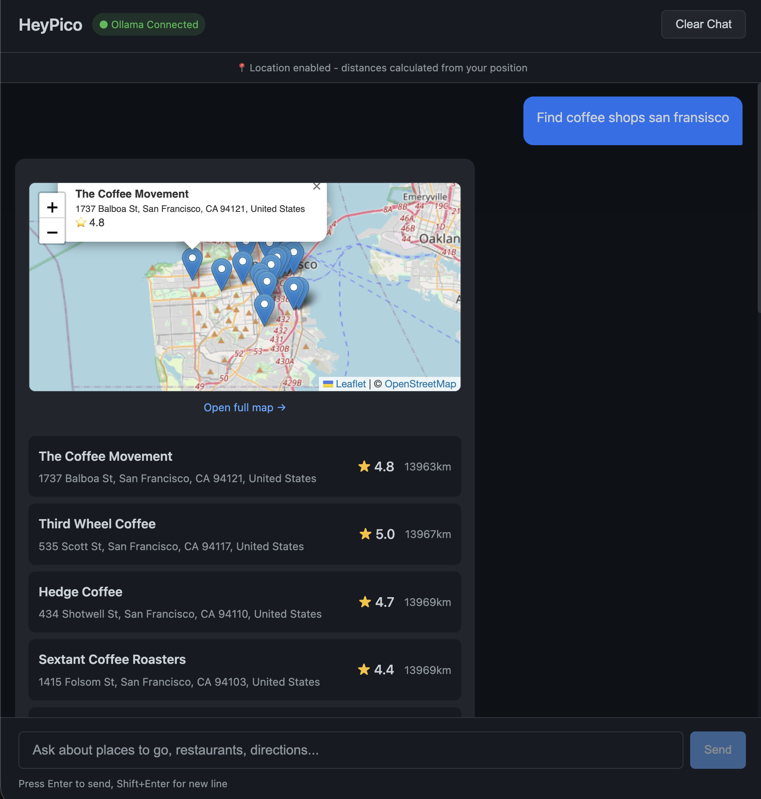
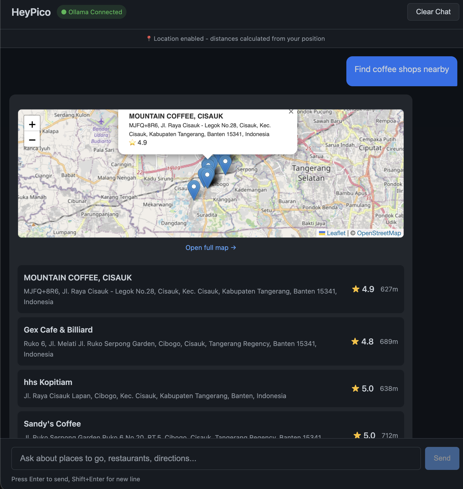

# HeyPico - Local LLM with Google Maps Integration

A local LLM system using Ollama + custom React frontend with Google Maps integration for finding places, restaurants, and directions with embedded maps in chat.

## Features

- **Local LLM**: Phi-3 Mini (3.8B) optimized for M1 8GB RAM
- **Google Maps Integration**: Search places, get details, and directions
- **Custom Chat UI**: Lightweight React interface with streaming responses
- **Embedded Maps**: Maps render directly in chat responses
- **API Security**: Rate limiting, input validation, and secure API key handling

## Architecture

```
User → React Frontend (localhost:3000)
         ↓
      Ollama (Docker) - Phi-3 Mini LLM
      Node.js Backend (localhost:3001) - Google Maps API
```

## Prerequisites

- Docker Desktop (for Ollama)
- Node.js 18+ (for frontend and backend)
- A Google Cloud account with API access

## Quick Start

### 1. Google Cloud Setup

1. Go to [Google Cloud Console](https://console.cloud.google.com/)
2. Create a new project
3. Enable these APIs:
   - Maps JavaScript API
   - Places API (New)
   - Directions API
4. Create API key with restrictions:
   - **Application restrictions**: None (for local dev)
   - **API restrictions**: Only Maps, Places, and Directions APIs
5. Set quotas to ~10,000 requests/day

### 2. Start Ollama (Docker)

```bash
cd heypico
docker-compose up -d

# Pull the Phi-3 Mini model
docker exec -it heypico-ollama-1 ollama pull phi3:mini

# Verify
docker exec -it heypico-ollama-1 ollama list
```

### 3. Start Backend API

```bash
cd backend
cp .env.example .env
# Edit .env and add your Google Maps API key
pnpm install
pnpm start
```

Runs on `http://localhost:3001`

### 4. Start Frontend

```bash
cd frontend
pnpm install
pnpm dev
```

Open `http://localhost:3000`

## Usage Examples

```
User: Find coffee shops in San Francisco

AI: I found several coffee shops in San Francisco:

[Embedded Map]

1. **Blue Bottle Coffee** - 66 Mint St, 4.5 stars
2. **Philz Coffee** - 101 Berry St, 4.3 stars
```

```
User: How do I get from Golden Gate Bridge to Fisherman's Wharf?

AI: Here are the driving directions from Golden Gate Bridge to Fisherman's Wharf:

- Distance: 5.2 miles
- Duration: 18 minutes

1. Head south on US-101 S
2. Continue onto Van Ness Ave
3. Turn right onto Bay St
4. Continue onto Embarcadero
```

## API Endpoints

| Endpoint | Method | Description |
|----------|--------|-------------|
| `/api/health` | GET | Health check |
| `/api/places/search` | GET | Search places (query, location, radius) |
| `/api/places/details` | GET | Get place details (placeId) |
| `/api/directions` | GET | Get directions (origin, destination, mode) |
| `/api/map/embed` | GET | Generate embeddable map (placeId or q) |

## Project Structure

```
heypico/
├── backend/              # Node.js Maps API server
│   ├── maps/
│   │   ├── places.js     # Places API wrapper
│   │   └── directions.js # Directions API wrapper
│   ├── server.js         # Express server
│   └── .env.example
├── frontend/             # React chat UI
│   ├── src/
│   │   ├── components/   # React components
│   │   ├── lib/          # Ollama integration
│   │   └── App.jsx       # Main app
│   └── vite.config.js
├── docker-compose.yml    # Ollama only
└── README.md
```

## Screenshots





## Map Embed Syntax in AI Responses

The AI uses custom `<map>` tags that get rendered as embedded maps:

```html
<map query="coffee shop San Francisco" />
<map placeId="ChIJRV_y5t0wAhcR7wjVZSjNhL0" />
```

## LLM Model

This project uses **Phi-3 Mini** (`phi3:mini` - 3.8B parameters), optimized for M1 8GB RAM.

To pull the model:
```bash
docker exec -it heypico-ollama-1 ollama pull phi3:mini
```

### Switching Models

For M1 8GB RAM:

| Model | Command | Notes |
|-------|---------|-------|
| Phi-3 Mini (default) | `ollama pull phi3:mini` | Best balance |
| Gemma 2B | `ollama pull gemma:2b` | Lightest |
| Llama 3.1 8B | `ollama pull llama3.1:8b` | Better quality, slower |

After pulling a new model, update `frontend/src/lib/ollama.js`:
```js
const MODEL = 'phi3:mini'; // Change to your model
```

## Troubleshooting

### Ollama not connecting
```bash
docker logs heypico-ollama
docker exec -it heypico-ollama-1 ollama list
```

### Maps API 403 error
- Verify API key has Maps, Places, and Directions APIs enabled
- Check API key restrictions in Google Cloud Console

### Frontend won't connect
- Ensure backend is running on port 3001
- Ensure Ollama is running on port 11434
- Check browser console for errors

## Stopping Services

```bash
# Stop Ollama
docker-compose down

# Stop backend (Ctrl+C in terminal)
# Stop frontend (Ctrl+C in terminal)
```

## License

MIT
